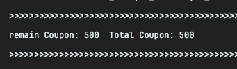
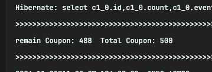
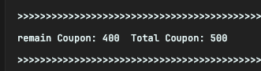
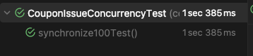
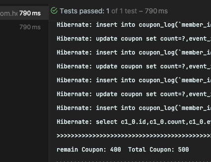
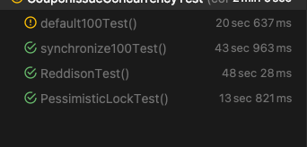

## 쿠폰 동시성 처리

### 공통 로직

#### 500개의 쿠폰 수량에 대해 100개의 쿠폰을 동시에 발행하는 테스트 케이스

⚠️ 동시성 체크를 위한 함수 작성으로, 빠져있는 검증 로직이 있을 수 있음.

### checkEventPeriodAndTime

이벤트 시간 내에 요청된 건인지 판별

```Java
void checkEventPeriodAndTime(Long eventId, LocalDateTime currentDateTime) throws Exception {

	Event event = eventRepository.findById(eventId).orElse(null);

	if (event.getStartTime().isAfter(currentDateTime) || event.getEndTime().isBefore(currentDateTime)) {
		throw new NotAcceptableStatusException("예외 시간");
	}
}
```

### issueCouponStatus

쿠폰 개수 줄이는 메소드

```Java
// transactional 관련 내용 작성
@Transactional
void issueCouponStatus(Long couponId) {
	Coupon coupon = couponRepository.findById(couponId).orElse(null);

	if (coupon.getCount() > 0) {
		coupon.setCouponCountDecrease();
		System.out.println("coupon decrease");
	} else {
		throw new NotFoundException("coupon");
	}
}
```

### issueCouponLog

쿠폰 발급 로그 설정

```Java
void issueCouponLog(Long couponId, Long userId) {
	couponLogRepository.insertLog(couponId, userId);
}
```

### Case 1 : Transactional 여부에 따른 결과값 다른 경우

두가지 케이스로 issueCouponStatus 함수를 작성하였을 때, 결과값이 다르게 나온 것을 알 수 있었다.

```Java
// transactional 관련 내용 작성
@Transactional
void issueCouponStatus(Long couponId) {
	Coupon coupon = couponRepository.findById(couponId).orElse(null);

	if (coupon.getCount() > 0) {
		coupon.setCouponCountDecrease();
		System.out.println("coupon decrease");
	} else {
		throw new NotFoundException("coupon");
	}
}
```

```Java
// transactional 관련 내용 작성
void issueCouponStatus(Long couponId) {
	Coupon coupon = couponRepository.findById(couponId).orElse(null);

	if (coupon.getCount() > 0) {
		coupon.setCouponCountDecrease();
		System.out.println("coupon decrease");
	} else {
		throw new NotFoundException("coupon");
	}

	couponRepository.save(coupon);
}
```

[@Transactional 어노테이션에 대해서 좀 더 살펴보자.](#transactional)

- Dirty Checking 을 통해 coupon에 대한 값을 업데이트 하는 케이스 before 500, after 500 -> 642ms
    - 이 경우는, 트랜잭션 종료 시점에 반영돼서 여러 트랜잭션이 같은 엔티티를 동시에 수정하면, 나중에 커밋된 트랜잭션이 이전 트랜잭션의 결과를 덮어 쓸 수 있기 때문
    - 
- .save 사용 시 before 500, after 488 -> 605ms
    - .save는 호출 즉시 db에 값을 저장하기 떄문에, 트랜잭션 격리 수준을 통해 결과의 정합성 유지 필요
    - 

### Case 2 : Synchronized를 활용한 접근 제한

쓰레드 단위로 해당 메소드에 접근을 제한하는 경우

한가지 java application 실행 경우에 멀티 스레드로 인한 동시성이 깨지기 때문에 한가지 쓰레드만 접근 가능한 synchronize를 메소드 단위로 적용하여 정합성 체크

```Java
public void issueCouponSynchronize(LocalDateTime localDateTime, long eventId, long couponId, long memberId) throws
	Exception {

	synchronized (this) {
		issueCouponDefault(localDateTime, eventId, couponId, memberId);
	}
}
```

기존 default 함수를 [synchronized](#synchronized) 적용. before : 500, after 400 -> 1s 385ms



멀티 스레드의 장점을 살릴 수 없고 delay 심하게 생김

### Case 3: Pessimistic Lock 적용

select 시점에 [pessimistic lock](#pessimistic-lock) 적용하여 값을 호출함



### Case 4: Redisson 적용

redis 활용한 분산락 적용하기
redisson client 설정
pub sub 기능을 활용한 Lock 적용

## 10000 thread test



### Transactional?

### Synchronized?

### Pessimistic Lock?